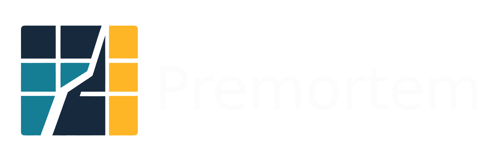

# Premortem

<p align="center">
  <a href="https://github.com/JustineDevs/premortem/releases"></a>
  <a href="https://github.com/JustineDevs/premortem"></a>
  <a href="https://github.com/JustineDevs/premortem"></a>
  <a href="https://premortem.jstn.site"></a>
  <a href="https://github.com/sponsors/JustineDevs"></a>
</p>

<p align="center">
  
</p>

<p align="center">
  <strong>Reviewer-first, graph-aware predictive audit system for repositories.</strong><br />
  Premortem ingests bounded repository context, runs a fixed specialist swarm, synthesizes traceable issue candidates, and requires human approval before anything reaches GitLab.
</p>

<p align="center">
  <a href="https://github.com/JustineDevs/premortem/releases">Releases</a> ·
  <a href="./docs/releases/releases-notes-v0.1.0.md">Release notes</a> ·
  <a href="./docs/architecture/adr-0001-canonical-product-and-system-design.md">Architecture ADR</a> ·
  <a href="./apps/web/app/docs">Docs hub</a> ·
  <a href="./SECURITY.md">Security</a>
</p>

## Why Premortem Exists

Modern delivery teams have scanners, dashboards, and AI summaries, but still struggle to answer a harder question:

> What is this repository likely to break next, why, and what should be reviewed before shipping?

Most workflows accumulate isolated alerts, brittle ownership assumptions, and generic AI text that is hard to trust or publish.

Premortem proposes a different contract:

- one bounded ingestion path per audit
- one shared truth substrate for specialist agents
- one reviewer queue with versioned edits
- one traceability chain from prompt to published issue
- no silent auto-publish on first-run paths

The result is governed repository intelligence: structured findings, inspectable evidence, and accountable publication decisions.

> [!TIP]
> Premortem is designed for teams that need foresight and review governance, not another chatbot that dumps unstructured text into an issue tracker.

## Product Story

Most teams only discover real failure modes in postmortems, after incidents, missed SLAs, or painful customer bugs. Premortem runs a **premortem on the repository itself** before merge or release: a multi-lens audit with the discipline of a staff engineer reviewing the whole system, not a linter flagging isolated lines.

For each GitLab project, Premortem asks **what could go wrong here?** as a structured analysis problem:

- **Ingestion**: bounded repository tree, CI history, dependencies, and configuration context.
- **Specialist swarm**: fixed lenses (structure, security, rollout, onboarding, integrations, and more) over a shared runtime substrate.
- **Synthesis**: clustering and deduplication into review-ready issue candidates with problem, expected behavior, suggested fix, success criteria, and why it matters.
- **Human gate**: maintainers inspect reasoning, edit, merge or split, and approve before anything is published to GitLab.

The reviewer console at `/app` exposes traceability: which lens surfaced a finding, supporting evidence, agent runs, and workflow canvas views over the audit pipeline and repository graph. Continuous audit mode can rotate scans when idle; Stop all returns control to manual runs.

**Stack (as implemented):** Next.js BFF and reviewer UI, Cloudflare Workers API and Queues, `@premortem/orchestrator` swarm execution with Gemini (and optional Azure OpenAI), GitLab OAuth plus REST ingest and issue publish, Supabase Postgres via Prisma, optional Neo4j graph snapshots. The optional `services/agent-builder` package now includes a Cloud Run-ready ADK runtime path with Gemini API or Vertex AI, optional database-backed sessions, and built-in Gemini safety settings; production audits still run through the orchestrator pipeline, not a hosted Agent Builder-only runtime.

**On the roadmap:** cross-repo boundary analysis, performance and SLO lenses, organization policy packs, CLI and GitLab pipeline gates for release blocking.

## What Premortem Is

Premortem is a reviewer-first, GitLab-first, swarm-orchestrated predictive audit platform.

```text
premortem/
├── apps/web/              Next.js marketing, auth, reviewer console (/app), BFF routes
├── apps/api/              Runtime API worker and local Node server
├── services/orchestrator/ Audit pipeline, specialists, publish/reconcile
├── packages/domain/       Cross-layer vocabulary and invariants
├── packages/db/           Prisma schema, entitlements, audit lifecycle
└── docs/                  Public architecture, runbooks, and release metadata
```

At the product level, Premortem delivers four responsibilities:

| Responsibility | Purpose |
| --- | --- |
| Ingestion | Bounded repository tree, CI, dependencies, and config context |
| Specialist swarm | Fixed roster of domain agents over shared runtime substrate |
| Synthesis | Findings, clustering, and structured issue candidates |
| Review & publish | Human approve/edit, GitLab publish, reconciliation visibility |

At the system level, those responsibilities map to cooperating layers:

| Layer | Role |
| --- | --- |
| Web shell | Public landing, Supabase auth, reviewer console at `/app` |
| BFF | Next.js route handlers that forward actor context to the runtime API |
| API runtime | Session validation, workspace mutations, audit enqueue/read |
| Orchestrator | Queue-backed execution, checkpoints, publish/reconcile |
| Data | Supabase Postgres (Prisma), Storage, optional graph services |

---

## Features

* **Bounded async audits**: Queue-backed runs with idempotency, leasing, and cooperative pause/resume checkpoints.
* **Specialist swarm**: Fixed agent roster with structured outputs, not generic summaries.
* **Reviewer console**: Dashboard, projects, audits, workflow canvas, sandbox, and settings in `/app`.
* **Continuous audit mode**: Optional automatic rotation when idle; Stop all halts runtime and returns control to manual scans.
* **Traceability chain**: Prompt version, agent run, finding, cluster, candidate, review action, published issue, reconciliation event.
* **Commercial gating**: Stripe plan state with server-side entitlements (`PLAN_LIMITS`) for repos, audits, and publish capability.
* **Observability hooks**: Sentry and PostHog wiring for runtime errors and product analytics.
* **Agent eval gate**: promptfoo-backed prompt evaluation for canonical Premortem prompt surfaces, with Langfuse-ready prompt management hooks.

---

<details open>
<summary><strong>Quick Start</strong></summary>

### Try the hosted app (recommended for judges and new users)

1. Open **[premortem.jstn.site/signup](https://premortem.jstn.site/signup)** and sign in with GitLab.
2. In **Settings → Integrations**, grant repository access (read_repository).
3. In **Projects**, enable a repository or add a public GitLab repo, then run a scan from **Audits**.

Source code: [github.com/JustineDevs/premortem](https://github.com/JustineDevs/premortem)

### Run locally (developers)


- Node.js 20+
- pnpm 9.12+
- Supabase project with Postgres (pooler + direct URLs)
- GitLab OAuth or token for provider flows (optional for local smoke with fixtures)

Copy environment template and fill secrets locally:

```bash
cp .env.example .env.local
```

> [!NOTE]
> Local dev loads repo-root `.env.local` via `scripts/load-local-env.mjs`. Never commit credentials, service-role keys, or provider tokens.

### 2. Install and run

```bash
pnpm install
pnpm run docker:up   # Neo4j graph store (and local Postgres if DATABASE_URL points at localhost)
pnpm run dev
```

Run the canonical prompt eval when LLM credentials are configured:

```bash
pnpm run eval:prompts
```

`pnpm run dev` runs `scripts/dev/run-local-stack.mjs`, which:

- ensures Docker services are up (Neo4j by default; Postgres when using local `DATABASE_URL`)
- syncs Prisma to the configured database
- starts the local API runtime (default `:18787`)
- starts the Next.js web app (default `:13000`)
- when `.env.local` has database, GitLab, LLM, and Supabase keys: **real auth** (Supabase OAuth), real GitLab ingest, and personal workspace onboarding
- when credentials are missing: fixture mode with `PREMORTEM_AUTH_DISABLED=1` and `LOCAL_DEV_FIXTURE` for smoke scripts only

Open:

- Marketing landing: `http://127.0.0.1:13000/`
- Reviewer console: `http://127.0.0.1:13000/app`
- API health: `http://127.0.0.1:18787/health`

### 3. Verify the loop

```bash
pnpm run smoke:local
pnpm run smoke:audit-flow
node scripts/canonical/verify-stack.mjs
```

> [!WARNING]
> Some packages may still have pre-existing typecheck gaps around orchestrator snapshot types. Treat smoke scripts and runtime verification as the primary local proof path until CI is fully green.

</details>

---

<details>
<summary><strong>Architecture at a Glance</strong></summary>

Premortem uses a layered architecture with explicit trust boundaries (see [ADR 0001](./docs/architecture/adr-0001-canonical-product-and-system-design.md)):

1. **`apps/web`**
   Public marketing, auth routes, reviewer console (`PremortemOsApp`), and BFF proxies for audits, workspace, billing, integrations, and reconciliation.
2. **`apps/api`**
   Runtime API with Supabase JWT validation, CORS, and organization-scoped mutations. Smoke/CI may use `PREMORTEM_AUTH_DISABLED=1` with fixture headers; production and configured local dev require real sessions.
3. **`services/orchestrator`**
   Audit job execution, specialist coordination, checkpoint pause/resume, GitLab publish, and reconciliation.
4. **`packages/domain` + `packages/db`**
   Canonical vocabulary, Prisma models, entitlements, and audit lifecycle helpers shared across web, API, and workers.

<details>
<summary><strong>Show canonical reviewer surfaces</strong></summary>

| Surface | Route / entry | Purpose |
| --- | --- | --- |
| Monitor dashboard | `/app` (dashboard tab) | Compliance overview, continuous audit toggle, runtime console |
| Projects inventory | `/app` (projects tab) | Register repos, trigger scans |
| Audits & tracing | `/app` (audits tab) | Findings, swarm lanes, runtime monitor |
| Workflow canvas | `/app` (canvas tab) | Visual pipeline and graph context |
| Settings | `/app` (settings tab) | Integrations, LLM, policies, billing |

Legacy `/reviews` redirects to `/app`.

</details>

</details>

## Canonical Stack

| Concern | Choice |
| --- | --- |
| Application shell | Next.js (`apps/web`) |
| Identity | Supabase Auth (single primary auth authority) |
| Database | Supabase Postgres via Prisma (or Docker Postgres for offline dev) |
| Artifacts | Supabase Storage (when enabled) |
| Graph store | Neo4j (`docker compose` + `NEO4J_URI`) |
| Async execution | Cloudflare Queues / local orchestrator path |
| Client state | TanStack Query in reviewer hooks |
| Observability | Sentry, PostHog |
| Billing | Stripe (commercial state only; not app identity) |
| Provider (v0.1.0) | GitLab-first connect, ingest, publish, reconcile |

> [!IMPORTANT]
> Do not introduce a second identity system for billing or provider flows. Stripe owns commercial entitlements input; Supabase Auth owns reviewer session truth.

---

## v0.1.0 Delivery Contract

`v0.1.0` must prove one coherent GitLab-first loop:

- [x] Supabase-authenticated reviewer shell and BFF routes
- [x] GitLab project registration and bounded audit enqueue
- [x] Queue-backed orchestrator execution with runtime console visibility
- [x] Findings, clusters, and issue candidates in `/app`
- [x] Versioned review actions and publish/reconcile starters
- [x] Real-user auth and workspace onboarding when Supabase + runtime credentials are configured
- [x] Full stranger self-serve onboarding without operator env (verified: `pnpm run smoke:production-readiness` → `"ok": true`, `strangerSelfServe`: true)

Out of scope for `v0.1.0`: GitHub parity, enterprise SSO rollout, multi-provider expansion, and full live-mode Stripe Checkout without dashboard account setup.

<details>
<summary><strong>Before You Push or Demo</strong></summary>

Run this gate locally before a demo or remote push. All commands assume repo-root `.env.local` is filled in.

```bash
pnpm run verify:env                    # credentials + integrations wired
node scripts/canonical/verify-stack.mjs # ADR §7 stack checklist
pnpm run smoke:hackathon               # GitLab, Gemini, Phoenix, agent builder
pnpm --filter @premortem/web build     # production Next.js build
pnpm --filter @premortem/web typecheck
pnpm --filter @premortem/api typecheck
pnpm run db:reset-billing              # optional: reset tiers to Free for upgrade demo
```

Demo path with real users:

1. `pnpm run dev` (configured mode: no `PREMORTEM_AUTH_DISABLED`)
2. Sign in at `/login` (Supabase + GitLab OAuth)
3. Connect GitLab and register a repository in `/app` → Settings / Projects
4. Run an audit from Projects or Dashboard
5. Review findings and exercise billing upgrade in Settings (Stripe test mode applies tiers in-app)

Production deploy checklist (never enable in remote environments):

- `PREMORTEM_AUTH_DISABLED` unset
- `PREMORTEM_PRODUCTION_MODE=1` where applicable
- Supabase service-role and provider tokens server-side only
- Stripe webhooks verified; Sentry and PostHog keys set
- See [SECURITY.md](./SECURITY.md) and `.internal/PRODUCTION-READINESS.md`

</details>

<details>
<summary><strong>Private and Generated File Policy</strong></summary>

| Path | Purpose |
| --- | --- |
| `/internal`, `/.internal`, `/docs/internal` | Private design, readiness, and submission context (gitignored) |
| `/artifacts` | Generated screenshots, exports, submission bundles (gitignored) |
| `/secrets` | Local secret material (gitignored) |
| `/dependencies/vendor`, `/dependencies/private` | Private vendor drops (gitignored) |

Browser clients must never receive raw provider secrets, Supabase service-role keys, or worker signing material.

</details>

---

## Repository Documentation

Public tracked docs:

- [ADR 0001: Canonical product and system design](./docs/architecture/adr-0001-canonical-product-and-system-design.md)
- [Canonical behavior rules](./.agents/rules/README.md) (mission, prediction policy, workflows, retention, failure handling)
- [Product flows](./docs/product/flows.md)
- [Session design](./docs/security/session-design.md)
- [Release notes v0.1.0](./docs/releases/releases-notes-v0.1.0.md)
- [Production deploy guide](./docs/releases/DEPLOY-PRODUCTION.md)
- [Changelog](./CHANGELOG.md)

Private or internal context (gitignored paths such as `/internal`, `/.internal`, `/docs/internal`):

- Production readiness gates, TA deep dives, UI layout references, and sprint closeout notes
- Cursor Obsidian vault bridge at `.cursor/obsidian-vault/` for working project context

Diátaxis docs hub (in app): `/docs` with tutorials, guides, reference, concepts, and troubleshooting.

---

## Community and Security

- Security policy: [SECURITY.md](./SECURITY.md)
- Code of conduct: [CODE_OF_CONDUCT.md](./CODE_OF_CONDUCT.md)
- Report vulnerabilities privately (see SECURITY.md). Do not open public issues for suspected security defects.

---

## Maintainers

| Field | Value |
| --- | --- |
| Author | `@Justinedevs` |
| Email | `justinedevs@jstn.site` |
| Domain | `premortem.jstn.site` |
| Repository | [github.com/JustineDevs/premortem](https://github.com/JustineDevs/premortem) |

---

<details>
<summary><strong>Acknowledgments</strong></summary>

Premortem is built on open source, managed services, and community projects. We are grateful to the teams and maintainers below.

#### Application and runtime

| Project | Role in Premortem |
| --- | --- |
| <a href="https://nextjs.org/"></a> [Next.js](https://nextjs.org/) | Web app shell, marketing, auth routes, BFF route handlers |
| <a href="https://react.dev/"></a> [React](https://react.dev/) | Reviewer console UI |
| <a href="https://www.typescriptlang.org/"></a> [TypeScript](https://www.typescriptlang.org/) | Shared typing across the monorepo |
| <a href="https://pnpm.io/"></a> [pnpm](https://pnpm.io/) + <a href="https://turbo.build/"></a> [Turbo](https://turbo.build/) | Workspace package management and build orchestration |
| <a href="https://developers.cloudflare.com/workers/"></a> [Cloudflare Workers](https://developers.cloudflare.com/workers/) + [Wrangler](https://developers.cloudflare.com/workers/wrangler/) | API worker runtime and deploy path |
| <a href="https://developers.cloudflare.com/queues/"></a> [Cloudflare Queues](https://developers.cloudflare.com/queues/) | Async audit job delivery (production path) |
| <a href="https://nodejs.org/"></a> [Node.js](https://nodejs.org/) | Local API server and tooling |

#### Identity, data, and graph

| Project | Role in Premortem |
| --- | --- |
| <a href="https://supabase.com/"></a> [Supabase](https://supabase.com/) | Auth, Postgres, and Storage |
| <a href="https://www.prisma.io/"></a> [Prisma](https://www.prisma.io/) | Schema, migrations, and database client |
| <a href="https://neo4j.com/"></a> [Neo4j](https://neo4j.com/) | Repository graph store (local Docker + bolt URI) |
| <a href="https://www.docker.com/"></a> [Docker](https://www.docker.com/) | Local Neo4j and optional Postgres via `docker compose` |

#### Integrations and commercial

| Project | Role in Premortem |
| --- | --- |
| <a href="https://about.gitlab.com/"></a> [GitLab](https://about.gitlab.com/) | OAuth, repository ingest, issue publish, reconciliation |
| <a href="https://stripe.com/"></a> [Stripe](https://stripe.com/) | Subscription checkout, webhooks, and plan entitlements |

#### AI, agents, and evaluation

| Project | Role in Premortem |
| --- | --- |
| <a href="https://ai.google.dev/"></a> [Google Gemini API](https://ai.google.dev/) | Primary LLM executor for specialist swarm |
| <a href="./services/orchestrator/"></a> [@premortem/orchestrator](./services/orchestrator/) | Queue-backed audit pipeline, specialist swarm, clustering, and publish path (primary runtime) |
| [Optional `services/agent-builder`](./services/agent-builder/) | Mission trace bootstrap hooks used by the orchestrator; not the sole production runtime |
| <a href="https://azure.microsoft.com/products/ai-services/openai-service"></a> [Azure OpenAI](https://azure.microsoft.com/products/ai-services/openai-service) | Optional alternate LLM backend |
| <a href="https://zod.dev/"></a> [Zod](https://zod.dev/) | Structured LLM and API output validation |
| <a href="https://www.promptfoo.dev/"></a> [promptfoo](https://www.promptfoo.dev/) | Canonical prompt evaluation gate (`pnpm run eval:prompts`) |

#### Observability and product analytics

| Project | Role in Premortem |
| --- | --- |
| <a href="https://sentry.io/"></a> [Sentry](https://sentry.io/) | Error tracking (web + API) |
| <a href="https://posthog.com/"></a> [PostHog](https://posthog.com/) | Product analytics and funnel events |
| <a href="https://langfuse.com/"></a> [Langfuse](https://langfuse.com/) | LLM trace and prompt observability hooks |
| <a href="https://phoenix.arize.com/"></a> [Arize Phoenix](https://phoenix.arize.com/) + [OpenInference](https://github.com/Arize-ai/openinference) | Tracing, evals, runtime MCP introspection ([guide](./docs/guides/phoenix-arize-track.md)) |

#### Reviewer console UI

| Project | Role in Premortem |
| --- | --- |
| <a href="https://tanstack.com/query"></a> [TanStack Query](https://tanstack.com/query) | Console data fetching and cache |
| <a href="https://www.radix-ui.com/"></a> [Radix UI](https://www.radix-ui.com/) | Accessible primitives (shadcn-style components) |
| <a href="https://tailwindcss.com/"></a> [Tailwind CSS](https://tailwindcss.com/) | OS console and utility styling |
| <a href="https://lucide.dev/"></a> [Lucide](https://lucide.dev/) | Icon set |
| <a href="https://vercel.com/font"></a> [Geist](https://vercel.com/font) | Typography |
| <a href="https://recharts.org/"></a> [Recharts](https://recharts.org/) | Dashboard analytics charts |
| <a href="https://reactflow.dev/"></a> [@xyflow/react](https://reactflow.dev/) | Workflow canvas |
| <a href="https://eclipse.dev/elk/"></a> [ELK](https://eclipse.dev/elk/) via [elkjs](https://github.com/kieler/elkjs) | Pipeline step auto-layout |
| <a href="https://github.com/d3/d3-force"></a> [d3-force](https://github.com/d3/d3-force) | Repository graph force-directed layout |

<details>
<summary><strong>Development tooling</strong></summary>

Cursor MCP plugins and documented servers used during development and ops (Sentry, PostHog, Stripe, Prisma, Cloudflare Docs, GitLab MCP, Postgres toolbox) are described in repo-root `mcp.local.json` and verified via `node scripts/mcp/verify-all.mjs`.

If we missed a dependency you rely on, please open an issue or PR to extend this list.

</details>

</details>

## License

[LICENSE](./LICENSE)
