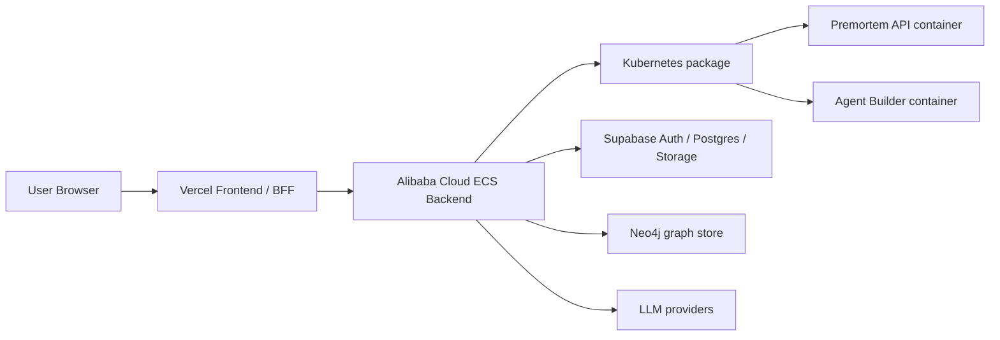

# Kubernetes runtime

Premortem keeps the production frontend on Vercel and the production backend on Alibaba Cloud ECS, but the backend is now packaged as a real Kubernetes workload set so the same runtime can move between ECS-hosted containers and cluster-backed deployment without changing the application contract.

The ECS release path is intentionally strict: the image is built on the CI runner, copied to ECS, loaded there, and started only after health passes. If the new container fails health, the previous container is restored.

## What is packaged

- `apps/api` becomes the public backend API container
- `services/agent-builder` becomes the agent runtime container
- `deploy/kubernetes/base` defines namespace, service account, config, pods, services, ingress, probes, resource limits, and network policy

## Why this exists

- The backend is container-native and should not depend on a one-off host script for its shape
- Dockerfiles now build production images instead of running `tsx` directly in production
- Kubernetes manifests document the intended security and scaling posture
- ECS and Kubernetes now share the same image build contract
- Helm mirrors the same runtime package for values-driven deployment, quotas, limits, and optional secret creation

## Current topology

## Docker contract

- `apps/api/Dockerfile` builds `premortem-api:prod`
- `services/agent-builder/Dockerfile` builds `premortem-agent-builder:prod`
- both images run as non-root users
- both images expose health endpoints and can be smoke-checked before rollout

## Kubernetes contract

- `premortem-api` is the public ingress-backed workload
- `premortem-agent-builder` is the internal worker/runtime workload
- resource requests and limits are set on every container
- resource quota and limit range guards constrain namespace usage
- a secrets template documents the required runtime keys
- default-deny network policy is included
- readiness, liveness, and startup probes are included

## Verification

The deployment package is considered valid when:

- the Dockerfiles build successfully
- `kubectl apply -k deploy/kubernetes/base` renders cleanly
- the backend health endpoint answers on the configured port
- the agent runtime health endpoint answers on port 8080
