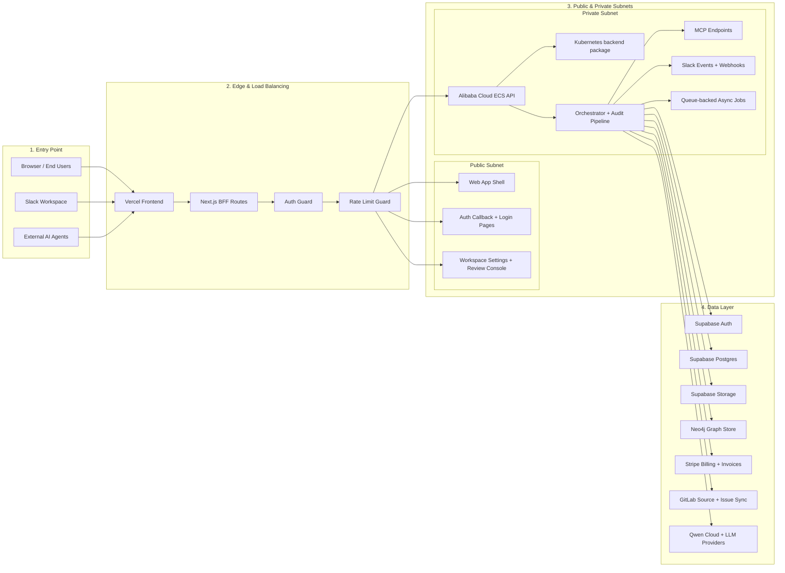

# Premortem four-tier topology

Friendly overview of the major system components and data flow.

## Rendered image


## 1. Entry Point

- Browser / end users
- Slack workspace
- External AI agents

## 2. Edge and Load Balancing

- Vercel frontend
- Next.js BFF routes
- Auth guard
- Rate limit guard

## 3. Public and Private Subnets

### Public subnet

- Web app shell
- Auth callback and login pages
- Workspace settings and reviewer console

### Private subnet

- API and orchestrator backend on Alibaba Cloud ECS
- Kubernetes packaging for the same backend runtime
- Audit pipeline
- MCP endpoints
- Slack events and webhooks
- Queue-backed async jobs

## 4. Data Layer

- Supabase Auth
- Supabase Postgres
- Supabase Storage
- Neo4j graph store
- Stripe billing and invoices
- GitLab source and issue sync
- Qwen Cloud and other LLM providers

## Hand-drawn sketch

```text
┌──────────────────────────────────────────────────────────────────────────────────────────────┐
│ 1. Entry Point                                                                               │
│                                                                                              │
│  Browser / End Users     Slack Workspace     External AI Agents                               │
└──────────────────────────────────────────────────────────────────────────────────────────────┘
                                       │
                                       ▼
┌──────────────────────────────────────────────────────────────────────────────────────────────┐
│ 2. Edge & Load Balancing                                                                     │
│                                                                                              │
│  Vercel Frontend        Next.js BFF Routes        Auth Guard        Rate Limit Guard         │
└──────────────────────────────────────────────────────────────────────────────────────────────┘
                                       │
                                       ▼
┌──────────────────────────────────────────────────────────────────────────────────────────────┐
│ 3. Public & Private Subnets (VPC boundary)                                                  │
│                                                                                              │
│  Public Subnet:                                                                            │
│   - app shell                                                                               │
│   - auth pages                                                                              │
│   - settings and review console                                                             │
│                                                                                              │
│  Private Subnet:                                                                            │
│   - Alibaba Cloud ECS backend                                                               │
│   - Kubernetes-packaged backend workloads                                                   │
│   - API + orchestrator                                                                      │
│   - audit pipeline                                                                          │
│   - MCP and Slack handlers                                                                  │
└──────────────────────────────────────────────────────────────────────────────────────────────┘
                                       │
                                       ▼
┌──────────────────────────────────────────────────────────────────────────────────────────────┐
│ 4. Data Layer                                                                                │
│                                                                                              │
│  Supabase Auth    Supabase Postgres    Supabase Storage    Neo4j    Stripe    GitLab    LLMs  │
└──────────────────────────────────────────────────────────────────────────────────────────────┘
```

## Renderable flowchart



## Legend

- Solid arrows: direct request or API flow
- Grouped boxes: environment or trust boundary
- Public subnet: externally reachable surfaces
- Private subnet: backend runtime and orchestration

## Reference proof links

- Alibaba Cloud deployment helper: [scripts/deploy/alibaba-cloud-ecs.ts](https://gitlab.com/gitlab-ai-hackathon/transcend/38920582/-/blob/main/scripts/deploy/alibaba-cloud-ecs.ts)
- Deployment metadata checker: [scripts/smoke/verify-env-utilization.ts](https://gitlab.com/gitlab-ai-hackathon/transcend/38920582/-/blob/main/scripts/smoke/verify-env-utilization.ts)
